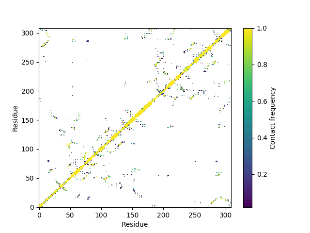

# ContactFrequency
Python script that calculates a matrix with the contact frequency from gmx mdmat output

## Usage
`python ContactFreq.py dmf.xvg numResidues [stride]`
* dmf.xvg: output file specified by -frames from gmx mdmat.
* numResidues: number of residues in the index selection used. 
* stride (optional): only calculate the frequency for every [stride] frames.

## Example:
`python ContactFreq.py sample.xvg 309`

